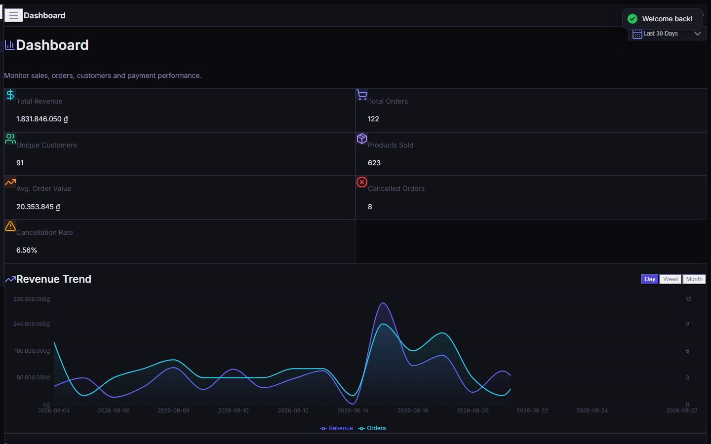
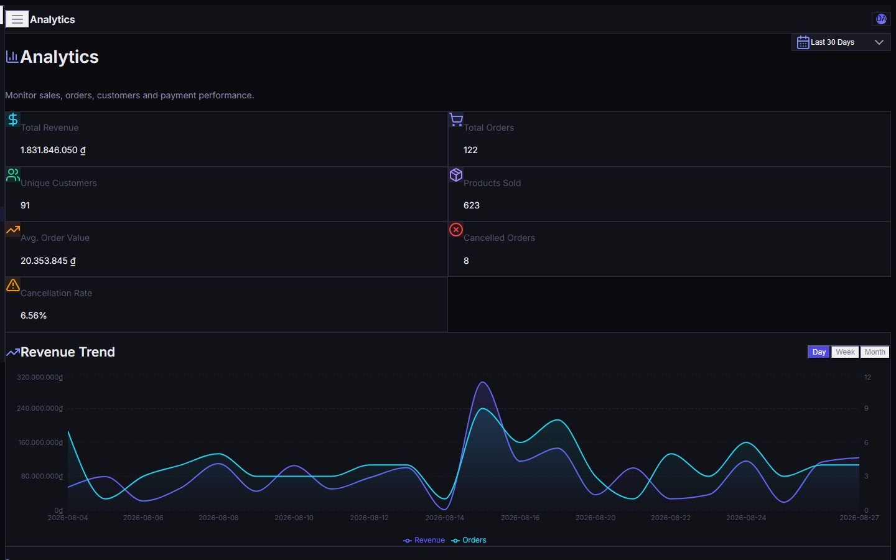
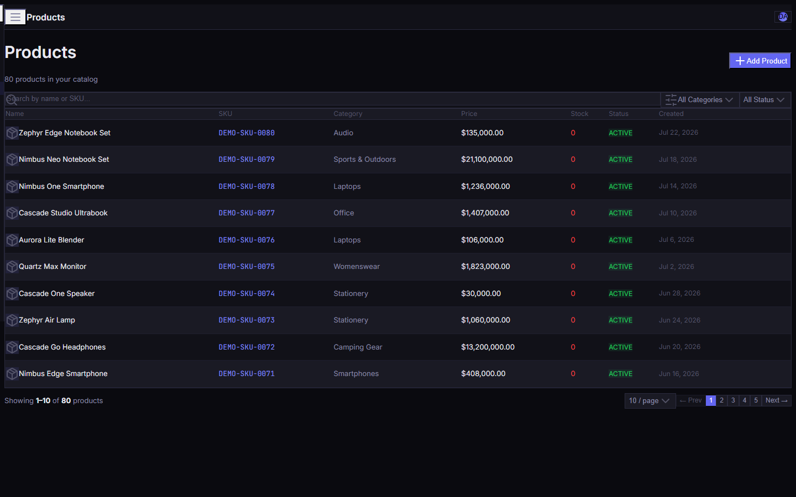
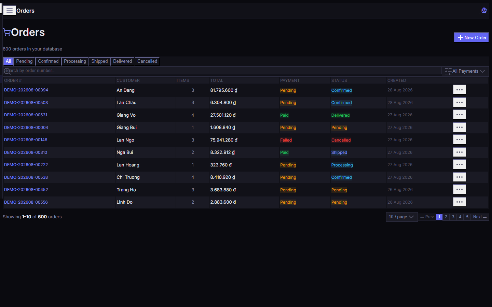
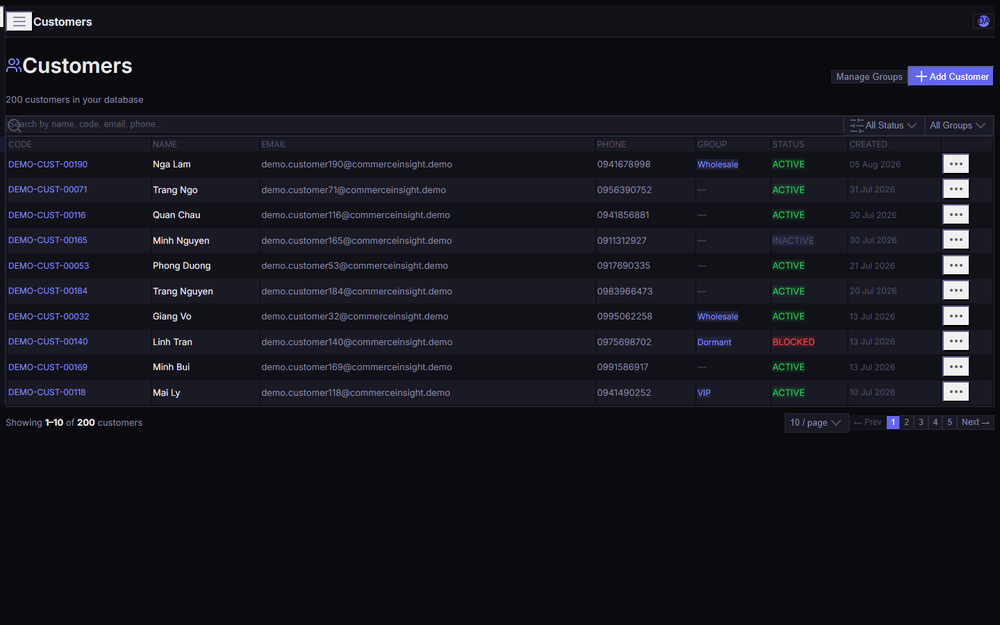
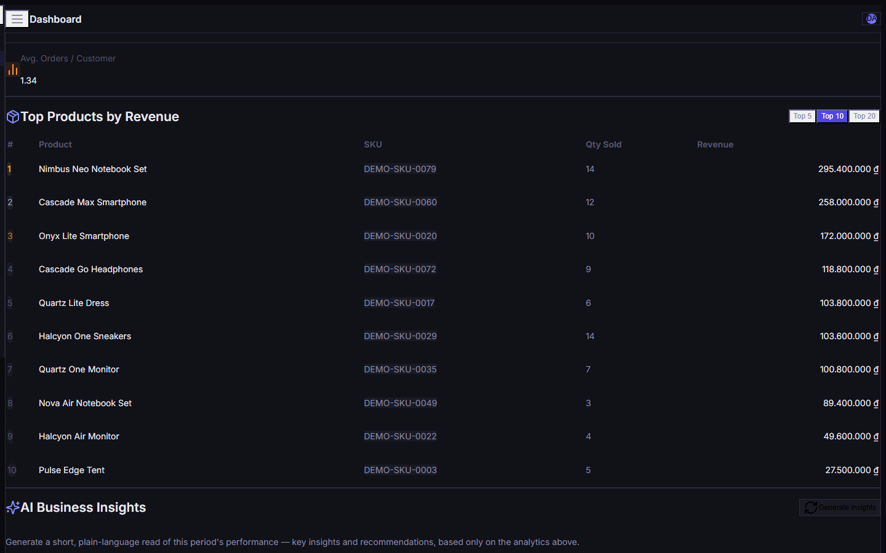
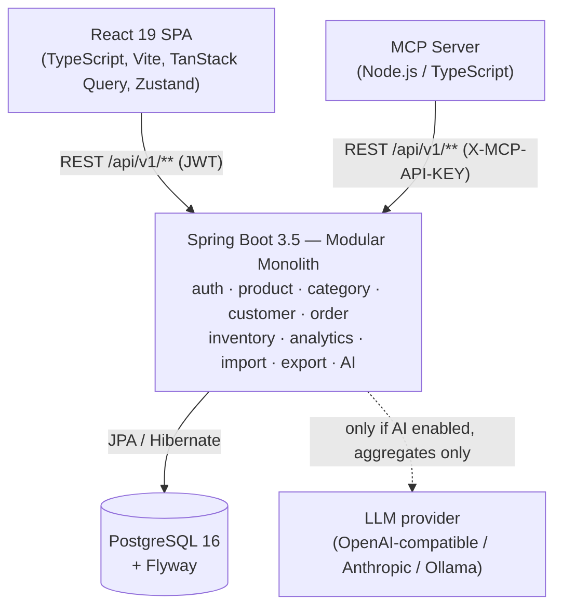
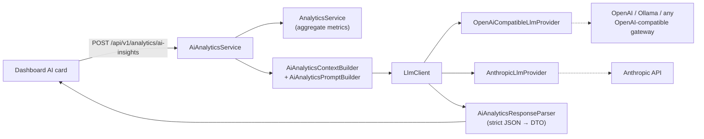

# Commerce Insight AI

> A modular-monolith ecommerce analytics platform — Spring Boot + React + PostgreSQL,
> with a Model Context Protocol (MCP) server and **optional** LLM-powered business insights.


[](https://github.com/M1nhng/Commerce-Insight-AI/actions/workflows/ci.yml)


Commerce Insight AI is a portfolio project that manages an ecommerce back office —
products, customers, orders, inventory — and turns the resulting data into an
analytics dashboard. On top of the dashboard sits an optional "AI Business
Insights" card that asks a configurable LLM provider to summarise the aggregated
numbers; it is **disabled by default** and its failure never affects the rest of
the app. A separate MCP server exposes the same REST API to AI agents.

- **Run it in one command:** [`./scripts/demo-up.sh`](#quick-start) → `http://localhost:5173`
- **Understand it in 2 minutes:** this README
- **Understand it in 15:** [`docs/portfolio/PROJECT_OVERVIEW.md`](docs/portfolio/PROJECT_OVERVIEW.md) → [`docs/architecture/ARCHITECTURE.md`](docs/architecture/ARCHITECTURE.md)

---

## Project highlights

- **Modular monolith** — one package per domain (`auth`, `product`, `category`, `customer`, `order`, `inventory`, `analytics`, `dataimport`, `export`, …), strict layer separation, no cross-module repository access
- **Java 17 / Spring Boot 3.5** REST API (`/api/v1/**`), consistent `ApiResponse<T>` envelope on every endpoint
- **PostgreSQL 16 + Flyway** — 31 versioned migrations, `ddl-auto=validate` (Hibernate never touches the schema)
- **JWT authentication + RBAC** — stateless access/refresh tokens, `ADMIN > MANAGER > STAFF` role hierarchy, method-level `@PreAuthorize`
- **Domain features** — product catalogue & categories, customers & customer groups, order lifecycle with status transitions, inventory with stock adjustments and reservations
- **Analytics dashboard** — revenue trend, order status mix, top products, payment-method split, customer metrics
- **CSV / Excel import** (async jobs with per-row error reporting) and **PDF / Excel export**
- **MCP server** (Node/TypeScript) — exposes the domain API to AI agents over the Model Context Protocol; talks **only** to the REST API, never the database
- **AI business insights** — pluggable `LlmClient` with OpenAI-compatible and Anthropic providers (Ollama works via the OpenAI-compatible path); optional, off by default, safe on failure
- **Docker Compose** — `postgres` + `backend` + `frontend` + `mcp-server`, plus dedicated demo and E2E overlays
- **GitHub Actions CI** — backend, frontend, MCP, static security scan, and a full Dockerised Playwright E2E run
- **Playwright E2E** — 25-test security suite + 9-test dashboard/AI suite
- **JaCoCo coverage** report (no gate) and a static secret-scan step

---

## Screenshots

Captured from the running demo stack — deterministic demo dataset, demo users, no real data.
More in [`docs/screenshots/`](docs/screenshots/).

| Dashboard | Analytics |
|---|---|
|  |  |

| Products | Orders |
|---|---|
|  |  |

| Customers | AI Business Insights (default state) |
|---|---|
|  |  |

---

## Architecture at a glance



**Boundary rules the codebase enforces:**

| Rule | Meaning |
|---|---|
| MCP → REST → Service → PostgreSQL | The MCP server never opens a DB connection and never calls an LLM directly. |
| Frontend → REST only | The SPA never talks to PostgreSQL. |
| AI behind `LlmClient` | Provider keys are read only by the backend; the LLM sees **aggregates only** — no PII, no raw order rows, no secrets. |
| AI failure is contained | If the provider is disabled, unreachable, slow, or returns junk, the endpoint responds `200` with `available: false` and the dashboard keeps working. |

Full detail: [`docs/architecture/ARCHITECTURE.md`](docs/architecture/ARCHITECTURE.md).

---

## Repository structure

```
commerce-insight-ai/
├── backend/            # Spring Boot 3.5 modular-monolith REST API (Java 17, Maven wrapper)
├── frontend/           # React 19 + Vite 6 + TypeScript + TailwindCSS 4 + shadcn/ui SPA
├── mcp-server/          # Node.js / TypeScript MCP server — REST-only adapter for AI agents
├── docker/             # Nginx config and Docker support files
├── docs/               # Architecture, demo, deployment, testing, security, performance docs
├── scripts/            # demo-up.sh / demo-reset.sh / security-check.mjs and dev helpers
├── .github/workflows/  # ci.yml, cd.yml, dependency-audit.yml
├── docker-compose.yml           # base stack: postgres + backend + frontend + mcp-server
├── docker-compose.demo.yml      # overlay: `demo` profile + large deterministic dataset
└── docker-compose.e2e.yml       # overlay: `e2e` profile + thin seed for the security E2E suite
```

| Path | Responsibility |
|---|---|
| `backend/` | All business logic, persistence, security, analytics, AI orchestration. The only component that touches the database or an LLM. |
| `frontend/` | Single-page app. Server state via TanStack Query, client state via Zustand, forms via react-hook-form + Zod. |
| `mcp-server/` | Thin Model Context Protocol adapter. Wraps REST endpoints as MCP tools/resources for AI agents. No DB, no LLM. |
| `docs/` | Living documentation. Design docs `00`–`15` are historical; the authoritative current docs are under `docs/architecture`, `docs/demo`, `docs/deployment`, `docs/portfolio`, `docs/testing`, `docs/security`, `docs/performance`. |
| `scripts/` | `demo-up.sh` (one-command demo), `demo-reset.sh` (wipe + reseed the demo), `security-check.mjs` (static secret scan). |

---

## Features

| Area | What it does |
|---|---|
| **Authentication** | Email/password login, stateless JWT access token (15 min) + rotating refresh token (7 days) with reuse detection, `logout` |
| **Authorization** | `ADMIN > MANAGER > STAFF` role hierarchy, method-level `@PreAuthorize`; unauthenticated → `401`, wrong role → `403`, both enveloped |
| **Products & Categories** | CRUD, two-level category tree, active/inactive, price tiers, soft delete |
| **Customers & Customer Groups** | CRUD, addresses, `ACTIVE / INACTIVE / BLOCKED` status, group assignment |
| **Orders** | Create from line items, status lifecycle with validated transitions, inventory reservation, payment record, per-order status history |
| **Inventory** | Per-warehouse stock, reservations, low-stock view, stock adjustments (some flows ADMIN-approved) |
| **Analytics** | `overview`, `revenue` (grouped by day/week/month), `orders`, `products/top`, `customers`, `payments` — all date-range filtered |
| **Import** | CSV/Excel upload for products/customers/orders, processed as async jobs, per-row error list, downloadable templates |
| **Export** | Products, customers, orders and five analytics reports as XLSX or PDF |
| **AI Insights** | `POST /api/v1/analytics/ai-insights` — sends aggregated analytics to an LLM, returns a structured summary + insights + recommendations. Optional, off by default. |
| **MCP** | The same domain surface exposed as MCP tools for AI agents (8 tool providers) |

---

## AI architecture

The AI layer is a **thin, optional wrapper** around the existing analytics service.



- **Optional & off by default** — controlled by `AI_INSIGHTS_ENABLED` (default `false`). With it off (or no key) the card shows "temporarily unavailable" and nothing else changes.
- **Provider abstraction** — `LlmClient` picks a `LlmProvider`. `openai` covers OpenAI and any OpenAI-compatible gateway (including a local **Ollama** at `http://localhost:11434/v1`); `anthropic` uses the Messages API.
- **Structured output** — the model is asked for strict JSON; `AiAnalyticsResponseParser` validates it into `AiInsightsResponse`. Malformed output → `available: false`, not a 500.
- **Privacy** — the context is **aggregates only**: totals, counts, trends, top-N names. No customer email/phone/address, no order or user UUIDs, no secrets.
- **Prompt-injection defence** — the analytics context is fenced as untrusted data; the system prompt forbids treating any string inside (product/customer/category names) as an instruction.
- **Safe failure** — provider disabled / unreachable / timing out / rate-limited / returning junk all resolve to `HTTP 200 { available: false }`. Provider response bodies are never logged or forwarded.
- **No secrets leak** — keys are read only by the backend (`AI_API_KEY` → `OPENAI_API_KEY` → `ANTHROPIC_API_KEY`), never sent to the frontend or MCP, never logged.

See [`docs/ai/SPRINT_AI_ANALYTICS_2.md`](docs/ai/SPRINT_AI_ANALYTICS_2.md) for the full design.

---

## Quick start

### Prerequisites

- Docker + Docker Compose (v2)
- ~4 GB free RAM for the stack
- Ports `5173`, `8080`, `3001`, `5432` free

Java, Node and Maven are **not** required to run the demo — everything builds inside Docker.
(For local development without Docker you need JDK 17, Node 20+, and the bundled Maven wrapper.)

### One command (Linux / macOS / WSL / Git Bash)

```bash
git clone https://github.com/M1nhng/Commerce-Insight-AI.git
cd Commerce-Insight-AI
./scripts/demo-up.sh
```

This builds the images if needed, starts `postgres + backend + frontend + mcp-server`
with the `demo` Spring profile, waits for the backend to become healthy (first boot
runs 31 migrations + the deterministic demo seed), then prints the URLs and credentials.

Reset to a clean seeded state at any time:

```bash
./scripts/demo-reset.sh              # wipe the demo DB volume, rebuild, reseed
./scripts/demo-reset.sh --keep-images  # same, but skip the image rebuild
```

### Windows (PowerShell / CMD) — direct Compose

The `.sh` scripts need Git Bash or WSL. Otherwise run the equivalent Compose
commands directly:

```powershell
docker compose -f docker-compose.yml -f docker-compose.demo.yml up -d --build
docker compose -f docker-compose.yml -f docker-compose.demo.yml ps
# reset:
docker compose -f docker-compose.yml -f docker-compose.demo.yml down -v
docker compose -f docker-compose.yml -f docker-compose.demo.yml up -d --build
```

### URLs

| Service | URL |
|---|---|
| Frontend (SPA) | http://localhost:5173 |
| Backend API | http://localhost:8080/api/v1 |
| Swagger UI | http://localhost:8080/swagger-ui.html *(enabled in `dev` / `demo`, disabled in `prod`)* |
| Backend health | http://localhost:8080/actuator/health |
| MCP health | http://localhost:3001/health |

### Demo credentials

> **DEMO ONLY — never reuse these credentials anywhere real.**
> They exist only in the demo-only seed (as BCrypt hashes) and in the docs.

| Role | Email | Password |
|---|---|---|
| ADMIN | `demo-admin@commerceinsight.demo` | `DemoAdmin!2024` |
| MANAGER | `demo-manager@commerceinsight.demo` | `DemoManager!2024` |
| STAFF | `demo-staff@commerceinsight.demo` | `DemoStaff!2024` |

### Recommended demo flow

Login as ADMIN → **Dashboard** → **Products** (80) → **Customers** (200) →
**Inventory** (80, incl. low-stock) → **Orders** (600) → **Analytics** →
**AI Insights** (shows "temporarily unavailable" unless you supply a key) →
**Import** (20 jobs, some with row errors) → **Export** (XLSX / PDF) → **Logout**.

Full walkthrough incl. role differences and troubleshooting:
[`docs/demo/DEMO_GUIDE.md`](docs/demo/DEMO_GUIDE.md).

---

## Local development (without Docker)

```bash
# 1. Database
docker compose up -d postgres

# 2. Backend  (from backend/) — needs JDK 17
./mvnw spring-boot:run -Dspring-boot.run.profiles=dev        # Windows: .\mvnw.cmd

# 3. Frontend (from frontend/) — needs Node 20+
cp .env.example .env.local
npm install && npm run dev

# 4. MCP server (from mcp-server/)
cp .env.example .env
npm install && npm run dev
```

---

## Testing

All numbers below are the current verified baseline (consolidated in Sprint 15,
re-checked in Sprint 16). "E2E" is split across two stacks — **do not read it as a
single 34/34 run**.

| Suite | Command | Result |
|---|---|---|
| Backend | `./mvnw -o test` (from `backend/`) | **509 tests · 0 failures · 0 errors · 1 intentional skip** |
| Frontend unit | `npx vitest run` (from `frontend/`) | **48 / 48** |
| Frontend lint | `npm run lint` | exit 0 (17 pre-existing advisory warnings, documented) |
| Frontend build | `npm run build` | passes, no chunk `> 500 kB` warning |
| MCP | `npm test` (from `mcp-server/`) | **59 / 59** |
| Static security scan | `node scripts/security-check.mjs` | **0 errors / 0 warnings** |
| E2E — security suite | Playwright vs the **`e2e`** stack | **25 / 25** |
| E2E — dashboard / AI suite | Playwright vs the **`demo`** stack | **9 / 9** |
| Coverage | JaCoCo 0.8.12 (report only, no gate) | **75.8 %** line overall · **81.5 %** excluding generated MapStruct mappers |

- The **1 skipped** backend test is `RealProviderManualTest`
  (`@EnabledIfEnvironmentVariable(AI_REAL_PROVIDER_TEST=true)`) — it needs a real
  LLM key and never runs in CI.
- The two E2E stacks use **different datasets**: the `e2e` overlay has a thin
  fixed-user seed for the security suite; the `demo` overlay has the ~600-order
  dataset the dashboard KPI assertions need. Run each suite against its own stack.

Details: [`docs/testing/TESTING_MATRIX.md`](docs/testing/TESTING_MATRIX.md),
[`docs/testing/SPRINT_15_TESTING.md`](docs/testing/SPRINT_15_TESTING.md).

---

## Performance

> **Local demo measurements on one developer machine (Docker Desktop / WSL2,
> deterministic ~600-order demo dataset). Indicative, not universal benchmarks.**

| Path | Measured |
|---|---|
| Analytics endpoints (`/api/v1/analytics/*`, 4 date windows) | **7–27 ms**, all HTTP 200 |
| Export — orders XLSX (~600 rows) | ~**1055 ms**, valid Excel 2007+ |
| Export — orders PDF (~600 rows) | ~**452 ms**, valid PDF |
| Export — products / customers (XLSX & PDF) | 31–89 ms |
| Import — job creation (async) | 23–71 ms |

- Import **bulk row-throughput** was not benchmarked — job creation is measured;
  end-to-end async processing throughput remains a known limitation. Import
  correctness is covered by the backend import test suite.
- Database: at demo scale (600 orders) PostgreSQL correctly sequential-scans the
  analytics queries; the composite indexes in the schema are the access paths a
  larger dataset would use. `EXPLAIN ANALYZE` on the demo data did not justify
  adding a new index, so none was added.

Details: [`docs/performance/SPRINT_15_PERFORMANCE.md`](docs/performance/SPRINT_15_PERFORMANCE.md).

---

## Security

| Control | Status |
|---|---|
| Stateless JWT (HS256), rotating refresh tokens, family reuse detection | ✅ |
| RBAC — `ADMIN > MANAGER > STAFF` hierarchy, method security | ✅ |
| `401` / `403` / `429` all returned as the standard error envelope | ✅ |
| Rate limiting — bucket4j, per-route (login, register, refresh, import, export, AI) | ✅ |
| MCP boundary — shared `X-MCP-API-KEY`, constant-time compare, fail-closed | ✅ |
| Security headers — HSTS, `Content-Security-Policy: default-src 'none'`, `X-Frame-Options: DENY`, `X-Content-Type-Options: nosniff`, `Referrer-Policy`, `Permissions-Policy`, `Cache-Control: no-store` | ✅ |
| `X-Request-Id` echoed on every response, including errors | ✅ |
| XSS — no `dangerouslySetInnerHTML` / `innerHTML` / `eval`; explicit regression test that AI text renders as inert text | ✅ |
| Error responses carry no stack trace, SQL, framework class, file path, key, or JWT | ✅ |
| Actuator — `health` / `info` public; `metrics` and everything else `ROLE_ADMIN`; `env` / `beans` / `configprops` / `mappings` not exposed | ✅ |
| Secrets — `node scripts/security-check.mjs` → 0/0; no `.env`, key, or token in tracked files | ✅ |
| AI privacy — aggregates only to the LLM, no PII, prompt-injection fencing, provider bodies never logged | ✅ |

Details: [`docs/security/SPRINT_15_SECURITY.md`](docs/security/SPRINT_15_SECURITY.md),
[`docs/security/PERMISSION_MATRIX.md`](docs/security/PERMISSION_MATRIX.md).

---

## CI / CD

**CI** ([`.github/workflows/ci.yml`](.github/workflows/ci.yml)) runs on every push to
`main` / `develop` / `sprint*` and on PRs:

| Job | Does |
|---|---|
| `backend` | `./mvnw -B -ntp clean verify` against a disposable Postgres service; uploads surefire + JaCoCo reports |
| `frontend` | `tsc --noEmit`, Vitest, `npm run lint`, production build |
| `mcp` | type-check, `node --test`, build |
| `security` | `node scripts/security-check.mjs` |
| `e2e` | brings up the full `docker-compose.e2e.yml` stack and runs the Playwright suite |

**CI never requires an AI provider key.** `AI_REAL_PROVIDER_TEST` is left unset;
the real-provider test stays opt-in and manual.

**CD** ([`.github/workflows/cd.yml`](.github/workflows/cd.yml)) builds the three
production images and pushes them to GHCR after CI passes on `main`. The **deploy
step is a guarded skeleton** — it self-skips with an explanatory message until the
`DEPLOY_SSH_*` repository secrets and a production host are configured. There is
no live production environment.

**Dependency audit** ([`.github/workflows/dependency-audit.yml`](.github/workflows/dependency-audit.yml))
runs `npm audit` + OWASP Dependency-Check weekly; advisory, non-blocking.

Details: [`docs/deployment/CI_CD.md`](docs/deployment/CI_CD.md).

---

## Environment variables

Copy [`.env.example`](.env.example) to `.env` and fill in real values before running
Compose with custom settings. The demo and E2E overlays carry their own clearly
labelled demo-only values, so **the quick-start needs no `.env` at all**.

| Group | Keys | Notes |
|---|---|---|
| Database | `DB_NAME`, `DB_USERNAME`, `DB_PASSWORD`, `DB_PORT` | |
| JWT | `JWT_SECRET` (≥ 32 chars; ≥ 64 in prod), `JWT_ACCESS_EXPIRATION_MS`, `JWT_REFRESH_EXPIRATION_DAYS` | prod refuses to boot with a dev/demo secret |
| MCP | `MCP_API_KEY` | shared secret between the MCP server and the backend |
| CORS | `CORS_ALLOWED_ORIGINS` | comma-separated origin list |
| AI (optional) | `AI_INSIGHTS_ENABLED` (default `false`), `AI_PROVIDER`, `AI_MODEL`, `AI_BASE_URL`, `AI_API_KEY` / `OPENAI_API_KEY` / `ANTHROPIC_API_KEY` | keys are read only by the backend; **never commit a real key** |

`.env.example` contains **placeholders only** — no real secret is ever committed.

---

## API surface

REST base path: `/api/v1`. Interactive docs: `http://localhost:8080/swagger-ui.html`
(dev / demo).

| Area | Endpoints (representative) |
|---|---|
| Auth | `POST /auth/login`, `POST /auth/register`, `POST /auth/refresh`, `POST /auth/logout` |
| Products | `GET/POST /products`, `GET/PUT/DELETE /products/{id}` |
| Categories | `GET/POST /categories`, `GET/PUT/DELETE /categories/{id}` |
| Customers | `GET/POST /customers`, `GET/PUT/DELETE /customers/{id}`, `GET/POST /customer-groups` |
| Orders | `GET/POST /orders`, `GET /orders/{id}`, `PATCH /orders/{id}/status` |
| Inventory | `GET /inventory`, `GET /inventory/low-stock`, `GET /warehouses`, `.../stock-adjustments` |
| Analytics | `GET /analytics/{overview,revenue,orders,products/top,customers,payments}` |
| AI insights | `POST /analytics/ai-insights` |
| Import | `POST /import/{products,customers,orders}`, `GET /import/jobs`, `GET /import/jobs/{id}/errors`, `GET /import/templates/{type}` |
| Export | `GET /export/{products,customers,orders}`, `GET /export/analytics/{revenue,orders,products,customers,payments}` (`?format=XLSX|PDF`) |
| Admin | `GET /users` and admin-only management (`ROLE_ADMIN`) |
| Actuator | `GET /actuator/health`, `/actuator/info` (public); `/actuator/metrics` (`ROLE_ADMIN`) |

---

## Where to look

| To review… | Start at |
|---|---|
| Backend architecture | `backend/src/main/java/com/commerceinsight/` (one package per domain) |
| Security | `backend/src/main/java/com/commerceinsight/security/` + `config/SecurityConfig.java` |
| Analytics | `backend/src/main/java/com/commerceinsight/analytics/` |
| AI integration | `backend/src/main/java/com/commerceinsight/analytics/ai/` (`AiAnalyticsService`, `llm/LlmClient`, `llm/*Provider`) |
| MCP server | `mcp-server/src/` (`tools/`, `client/`, `config/`) |
| Frontend | `frontend/src/features/` (feature-first) + `frontend/src/lib/` (`apiError`, `authTokens`) |
| Backend tests | `backend/src/test/java/` |
| Frontend tests | `frontend/src/**/*.test.tsx`, `frontend/e2e/` |
| MCP tests | `mcp-server/src/**/*.test.ts` |
| CI | `.github/workflows/ci.yml` |
| Demo | `docker-compose.demo.yml`, `scripts/demo-up.sh`, `docs/demo/DEMO_GUIDE.md` |
| Migrations | `backend/src/main/resources/db/migration/` (`V1`–`V31`) + `db/demo/R__seed_demo_data.sql` |

---

## Documentation index

| Doc | Contents |
|---|---|
| [`docs/portfolio/PROJECT_OVERVIEW.md`](docs/portfolio/PROJECT_OVERVIEW.md) | Interview-oriented tour: problem, solution, engineering decisions, trade-offs |
| [`docs/architecture/ARCHITECTURE.md`](docs/architecture/ARCHITECTURE.md) | System overview, modules, request flows, constraints, trade-offs |
| [`docs/demo/DEMO_GUIDE.md`](docs/demo/DEMO_GUIDE.md) | Prerequisites, startup, health checks, demo users, flow, reset, troubleshooting |
| [`docs/deployment/CI_CD.md`](docs/deployment/CI_CD.md) | Every workflow: triggers, jobs, secrets, deployment status |
| [`docs/testing/TESTING_MATRIX.md`](docs/testing/TESTING_MATRIX.md) | Test layers, frameworks, scope, counts |
| [`docs/security/SPRINT_15_SECURITY.md`](docs/security/SPRINT_15_SECURITY.md) | Full security posture verification |
| [`docs/performance/SPRINT_15_PERFORMANCE.md`](docs/performance/SPRINT_15_PERFORMANCE.md) | Measured latencies and query plans |
| [`docs/adr/`](docs/adr/) | Architecture Decision Records (modular monolith, MCP server, security hardening) |
| `docs/00`–`15` | Original design docs — historical, superseded by the above where they conflict |

---

## License

MIT — see [LICENSE](LICENSE).

> The demo dataset, demo credentials, and every secret in the committed compose
> overlays are **for local demonstration only** and must never be reused in a real
> deployment.
